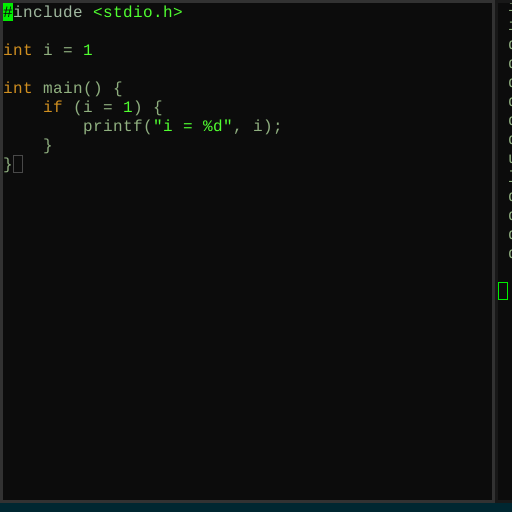

# railgun.vim
railgun.vim is plugin that tries to implement dynamic interactive indentination
for vim (i.e interactive code styling).

this workflow is directly inspired by how Allen Webster's [4coder](http://4coder.net/) interacts
with intentation in code.\

## Disclammer
project is yet to be implemented

## Installation
for pick and place plugin management use:\
`git clone https://github.com/skrshe/railgun`

for information on how vim plugins work visit [this gist](https://gist.github.com/manasthakur/ab4cf8d32a28ea38271ac0d07373bb53)

## License
unlicense SKrshe 2021.  For more information, please refer to
<http://unlicense.org/>
